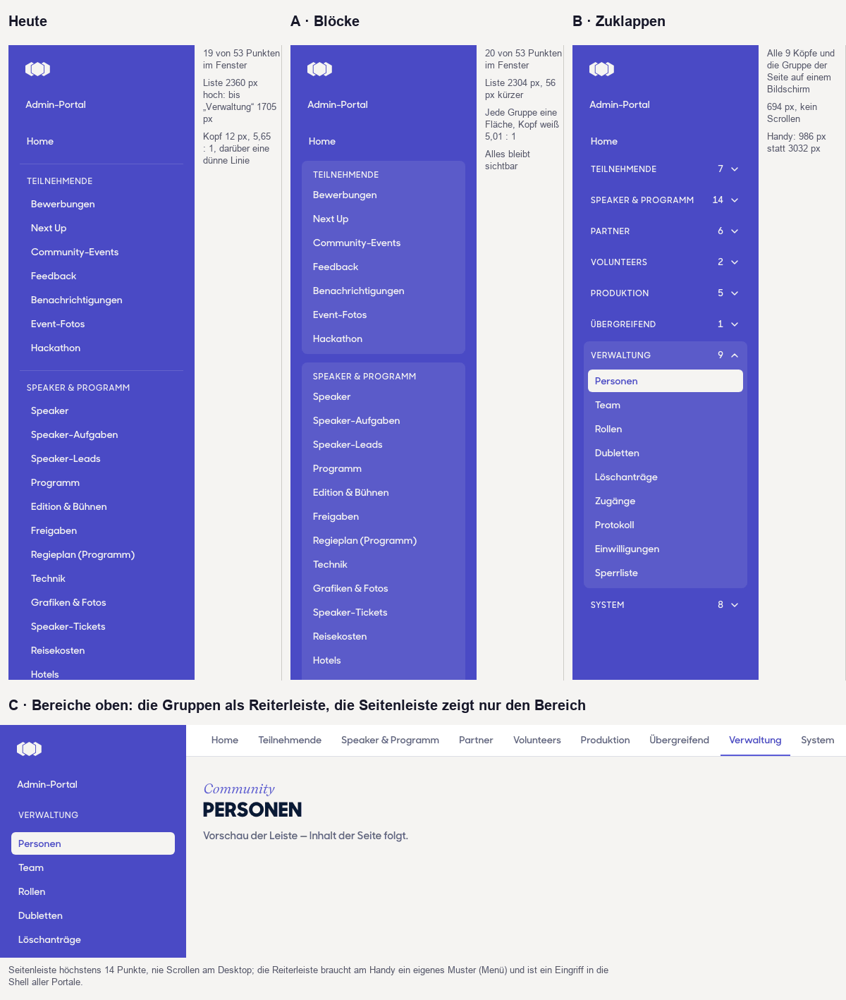
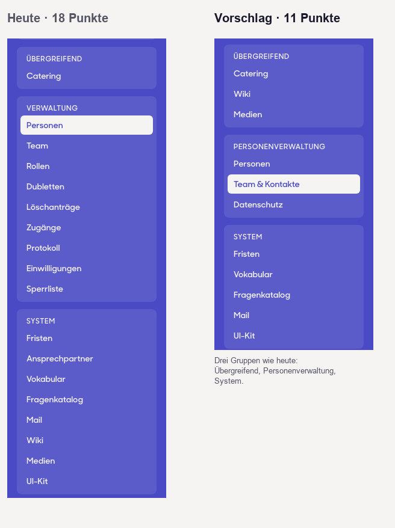
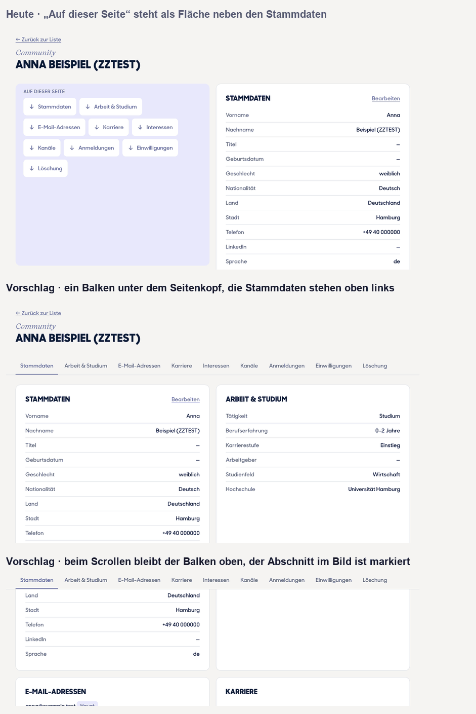
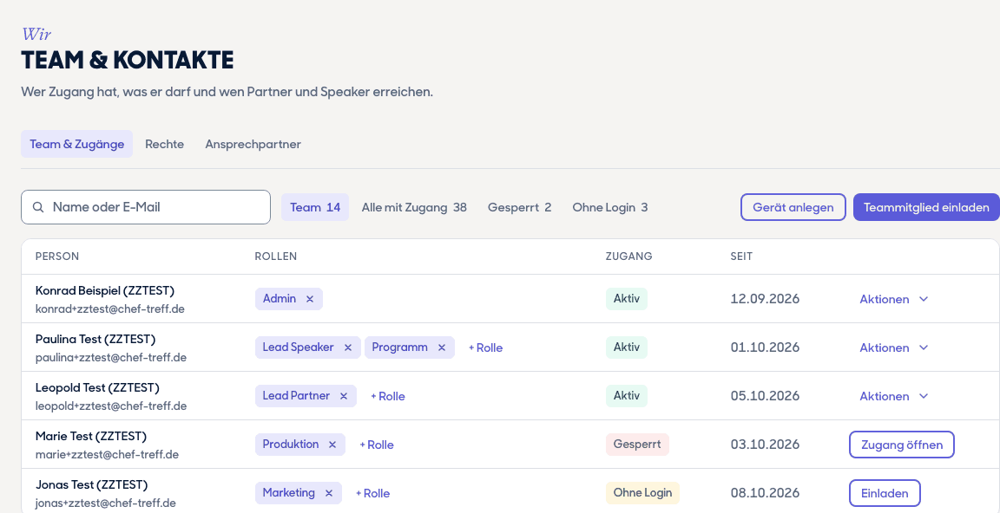
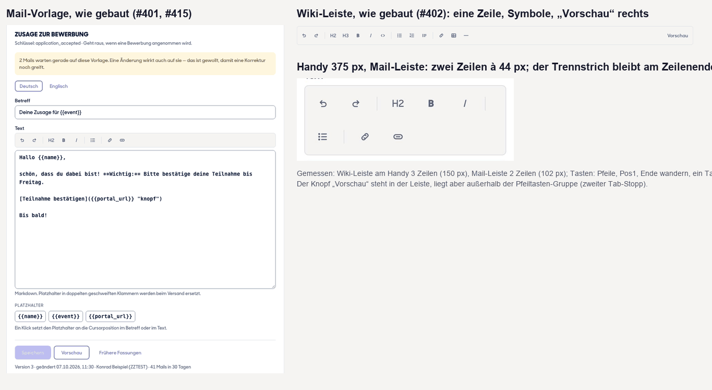

# Design-Vorschläge · 09.10.2026

> **Stand 09.10. mittags: Entwurf auf dem Branch `design/vorschlaege-1009` — Lesedurchgang, Gate und PR stehen aus (Sitzungslimit).**

Konrads Admin-Feedback, Teil 1 (ADM-088 bis ADM-105): Der Design-Chat liefert einen **Vorschlag** zur Struktur des Admin-Bereichs — Seitenleiste, Gliederung, „Auf dieser Seite“, Team & Zugänge, Ansprechpartner — und prüft die Editoren; der Admin-Chat baut nach Konrads Go. Grundlage ist die Bestandsaufnahme vom 08.10. (`docs/design-vorschlaege-2026-10-08.md`, #376: 53 Menüpunkte, 79 Seiten). **Nur Vorschlag: an Shell und Navigation ändert sich nichts vor Konrads Go.** Offen für Konrads Teil 2 (Speaker, Teilnehmende, Partner, Volunteers, Abschnitt 9).

**Was seit der Bestandsaufnahme gebaut wurde** (Stand `main` b4996fa7, 09.10.): Personenliste mit Suche und Filter und Stammdaten bearbeiten (ADM-091/092, #392), Protokoll (ADM-095, #391), Einwilligungen je Person (ADM-096, #395), Löschanträge und Sperrliste auf einer Seite (ADM-097, #434), Dubletten unter Personen (ADM-098, #435), Fristen je Bereich (ADM-099, #411), Vokabular mit Suche (ADM-101, #414), Mail-Vorlagen mit Editor (ADM-102, #401, #415), Wiki-Liste und Editor (ADM-103, #402, #407), Ansprechpartner ohne „Zeiten“ (ADM-100, #386). **Das Menü ist dabei gleich geblieben: 53 Punkte** (nur „Übersicht“ heißt jetzt „Home“ und „Ansprechpartner & Zeiten“ „Ansprechpartner“; mit dem Skript der Bestandsaufnahme nachgezählt). Deshalb sind die Editoren und die Datenschutz- und Personenseiten hier eine **Abnahme** (Abschnitte 7 und 8); neu vorgeschlagen wird, was noch aussteht.

| Punkt | Wo | baut | Kern |
|---|---|---|---|
| [ADM-088](#2--adm-088-menügruppen-klar-trennen) | Seitenleiste aller Portale (Shell) | Design (Shell), nach Go | **Gruppen als eigene Flächen** am Desktop (Variante A), **zuklappbare Gruppen** unter 1024 px (B); die Reiterleiste oben (C) nicht |
| [ADM-089/090/100/101/105](#3--adm-089090100101105-die-neue-gliederung) | Menü, Personenverwaltung, System | Admin-Chat (Menü, Reiter), Design (Prüfung) | **53 → 46 Punkte:** „Verwaltung“ wird „Personenverwaltung“ mit **drei Punkten und Reitern** auf den bestehenden Adressen; Wiki und Medien nach „Übergreifend“ |
| [ADM-093](#4--adm-093-auf-dieser-seite-als-balken) | fünf Detailseiten | Design (Kit), Admin-/Speaker-Chat (Seiten) | **Ein klebender Balken** unter dem Seitenkopf statt einer Fläche neben den Stammdaten |
| [ADM-094](#5--adm-094-team--zugänge-eine-seite) | `/admin/team` + `/admin/verwaltung/zugaenge` | Admin-Chat | **Eine Seite, vier Filter, eine Aktion je Zeile**; „Rechte“ und „Ansprechpartner“ als Reiter daneben |
| [ADM-100](#6--adm-100-ansprechpartner-als-liste) | `/admin/ansprechpartner` | Admin-Chat | **Liste statt Karten**, Bearbeiten im Schubfach, für alle Teamrollen lesbar |
| [ADM-102 f / 103 g](#7--editoren-adm-102-f-adm-103-g-abnahme) | Mail-Vorlagen, Wiki | Design (kleiner Kit-PR) | **Gebaut nach dem Muster der Toolbar** — drei kleine Nachbesserungen an der Leiste, kein Umbau |
| [ADM-095 bis 098](#8--abnahme-datenschutz--und-personenseiten-adm-095-bis-098) | Datenschutz- und Personenseiten | — | Gebaut; **eine Ebene Reiter**, Filter darunter als Auswahlknöpfe (betrifft Dubletten) |

Gemeinsam: nichts Neues in Farbe, Schrift oder Form; Zustand in Form **und** Wort; Touch-Ziele 44 px; DE und EN; **Konrads Konto sieht alles** (Admin öffnet jeden Punkt und jeden Reiter), und jede Funktion bleibt im Admin erreichbar (Admin-Vollständigkeit): der Vorschlag verschiebt nur, er streicht keine Funktion. Die Bilder liegen in `docs/bilder/`, die Skizzen sind aus den echten Bausteinen gerendert (lokale Vorschauseite, nicht eingecheckt); wo etwas nicht gemessen ist, steht es dabei.

## 0 · Kurzfassung

1. **Seitenleiste (ADM-088):** A (Gruppen als Flächen) am Desktop, B (zuklappbar, die Gruppe der Seite offen) unter 1024 px, **in allen Portalen zugleich** (Skill-Regel 11). Am Handy steht die Leiste heute über dem Inhalt: bei Konrad ist die Leiste 3032 px hoch und der Inhalt beginnt bei **3126 px = 3,8 Bildschirmen**; mit B ist die Leiste 986 px hoch.
2. **Gliederung (ADM-089/090/100/101/105):** 53 → 46 Punkte, keine Funktion verschwindet. Drei Punkte unter „Personenverwaltung“, jeder mit Reitern; „Übergreifend“: Catering, Wiki, Medien; „System“: fünf technische Punkte.
3. **„Auf dieser Seite“ (ADM-093):** Balken statt Fläche; ein Kit-Baustein, fünf Seiten.
4. **Team & Zugänge (ADM-094):** wie Plan am 08.10. entschieden hat; hier die Gestalt der Seite.
5. **Ansprechpartner (ADM-100):** Liste, Schubfach, lesbar für alle Teamrollen.
6. **Editoren:** gebaut, Abnahme gegen das Standardmuster (APG-Toolbar): **bestanden**, drei kleine Nachbesserungen.
7. **Reiter-Regel:** eine Ebene; Filter im Reiter sind Auswahlknöpfe.
8. **Fragen:** neun an Konrad, vier an den Admin-Chat (Ende des Dokuments).

---

## 1 · Befund: was die Leiste heute misst

Gemessen mit der echten `SidebarShell` und den echten Punkten in einer lokalen Vorschauseite (ohne Login), 1440 × 900 und 375 × 812 (Touch); 08.10., das Menü ist seither gleich.

| | Admin (Konrad) | Programm | Lead Produktion | Lead Partner |
|---|---|---|---|---|
| Punkte / Gruppenköpfe | 53 / 8 | 23 / 5 | 20 / 6 | 13 / 3 |
| Höhe der Liste | 2240 px | 1055 px | 1008 px | 605 px |
| im 900-px-Fenster ohne Scrollen | 19 Punkte | 16 | 15 | alle 13 |

- **Formel** (an vier Rollen bestätigt): Liste = 34 px × Punkte + 55 px × Köpfe − 2 px; ein Punkt ist 32 px hoch (34 mit Abstand), die Leiste scrollt ab etwa 780 px Liste.
- **Bei Konrad** beginnen die Gruppen bei 185 px (Teilnehmende), 478 (Speaker & Programm), 1009 (Partner), 1268 (Volunteers), 1391 (Produktion), 1616 (Übergreifend), **1705 (Verwaltung)** und 2066 px (System): die Verwaltung liegt 1,9 Bildschirme unter dem Fensterrand.
- **Die Trennung heute:** Gruppenkopf `ct-eyebrow` 12 px in `accent-soft` auf `accent-deep` (5,65 : 1), darüber eine Linie in 15 % Weiß und 16 px Abstand; die Punkte stehen eingerückt. Bei 53 Punkten sieht man eine lange Liste mit dünnen Linien.
- **Am Handy** (Punkt 44 px) steht die Leiste **über** dem Inhalt, ohne Menü-Knopf: Konrads Leiste ist 3032 px hoch (Liste 2876 px), der Inhalt beginnt bei 3126 px.
- **Die Gruppen sind kein Ordnungsprinzip der Rollen:** die 13 Teamrollen sehen zwischen 6 und 23 Punkte, 11 Punkte öffnet nur Admin (Bestandsaufnahme, Abschnitt 3). Wer nur wenige Punkte sieht, braucht die Trennung kaum; wer alle sieht — Konrad —, braucht sie am dringendsten.

## 2 · ADM-088 Menügruppen klar trennen

**Anlass (Konrad):** „Menügruppen visuell klarer trennen, trotz der vielen Menüpunkte.“ Verlangt ist ein Vorschlag, Umsetzung nach Teil 2.

| | Heute | **A · Blöcke** | **B · Zuklappen** | C · Bereiche oben |
|---|---|---|---|---|
| Idee | Linie und Kopf | jede Gruppe eine Fläche (etwas heller als die Leiste), 12 px Abstand | Köpfe als Zeilen mit Zähler und Pfeil; die Gruppe der aktuellen Seite ist offen | die Gruppen als Reiterleiste über dem Inhalt, die Seitenleiste zeigt nur den Bereich |
| Leiste, Admin (1440 × 900) | 2360 px | 2304 px (−56) | **694 px, kein Scrollen** | höchstens 14 Punkte |
| im Fenster | 19 von 53 | 20 von 53 | alle 9 Köpfe und die Gruppe der Seite | alle Punkte des Bereichs |
| Kopf (12 px) | 5,65 : 1 auf `accent-deep` | 5,01 : 1 (Weiß 12 px/600 auf der Fläche) | wie heute | — |
| Handy (375 px) | 3032 px | 2960 px | **986 px = 1,2 Bildschirme** | eigenes Muster nötig |
| „alle Funktionen direkt auffindbar“ | ja | **ja** | nur die Köpfe mit Zähler sichtbar, ein Klick mehr | ja, im Bereich |

**Empfehlung: A am Desktop (ab 1024 px), B darunter — in allen Portalen zugleich.** Gründe:

- **A erfüllt ADM-089 („direkt auffindbar“) und ADM-088 zugleich:** nichts wird versteckt, die Gruppen trennt eine Fläche statt einer Linie, der Kopf bleibt über 4,5 : 1. Die Höhe sinkt nicht (−56 px) — A löst die Trennung, nicht die Länge; die Länge löst die neue Gliederung (Abschnitt 3: 2240 → 2002 px).
- **B ist am Handy keine Frage der Auffindbarkeit, sondern des Zugangs zum Inhalt:** 3,8 Bildschirme Menü vor der ersten Zeile Inhalt sind für Check-in und Produktion, die am Handy arbeiten, ein Fehler, kein Geschmack.
- **C nicht:** die Reiterleiste ist ein Eingriff in die Shell aller Portale, am Handy braucht sie ein eigenes Muster, und sie legt **zwei Reiterleisten** auf eine Seite (Bereiche oben, Seitenreiter darunter) — Reiter wechseln die Seite, mehr als eine Ebene verwirrt.
- **Skill-Regel 11:** strukturelle Änderungen an globalen Seiten gelten in **allen** Portalen zugleich, nie nur im Admin. A und B stehen in `SidebarNav`/`SidebarShell`, die alle Portale tragen.
- Offen (Frage 9): eine **Menü-Suche** („Funktion tippen, springen“) als Zugabe — gerade bei 46 Punkten.

Umsetzung (nach Go, Design, ein PR): `SidebarNav` bekommt die Fläche je Gruppe (Klassen aus vorhandenen Tokens, kein neuer Wert) und unter `lg` die zuklappbare Fassung (`
`-artig, Zähler und Pfeil im Kopf, `aria-expanded`, 44 px); Tests über alle Bereiche, Gegenproben, Messung 1440 und 375 px.

## 3 · ADM-089/090/100/101/105 Die neue Gliederung

**Anlass:** „UX- und Strukturprüfung des gesamten Admin: modern, vor allem intuitiv — alle Funktionen direkt auffindbar“ (ADM-089); Verwaltung → **Personenverwaltung** mit drei Bereichen (ADM-090); Ansprechpartner als Liste und in die Personenverwaltung (ADM-100); eigener Bereich **System** (ADM-101); Wiki und Medien nach „Übergreifend“ (ADM-103 h, ADM-105).

### 3.1 · Die Gruppen

| Gruppe | Punkte heute | Punkte neu | Inhalt neu |
|---|---|---|---|
| (ohne Kopf) | 1 | 1 | Home |
| Teilnehmende | 7 | 7 | unverändert |
| Speaker & Programm | 14 | 14 | unverändert (Teil 2) |
| Partner | 6 | 6 | unverändert (Teil 2) |
| Volunteers | 2 | 2 | unverändert (Teil 2) |
| Produktion | 5 | 5 | unverändert |
| **Übergreifend** | 1 | **3** | Catering · **Wiki** · **Medien** |
| **Personenverwaltung** (heute „Verwaltung“) | 9 | **3** | **Personen** · **Team & Kontakte** · **Datenschutz** |
| **System** | 8 | **5** | Fristen · Vokabular · Fragenkatalog · Mail · UI-Kit |
| **Summe** | **53** | **46** | |

Drei Punkte verlassen das „System“ (Wiki, Medien → Übergreifend; Ansprechpartner → Team & Kontakte), sechs Punkte der Verwaltung gehen in den drei neuen Punkten auf (als **Reiter**). **Alle Adressen bleiben** (die Reiter sind die bestehenden Seiten); nur `/admin/team` und `/admin/verwaltung/zugaenge` werden zu einer Seite (ADM-094). Die Reihenfolge der Gruppen bleibt (Frage 2).

### 3.2 · Personenverwaltung: drei Punkte mit Reitern

Konrads drei Bereiche (ADM-090) sind **drei Menüpunkte**, jeder mit Reitern:

| Menüpunkt | Reiter (Adresse) | Konrads Bereich |
|---|---|---|
| **Personen** | Alle Personen (`/admin/personen`) · **Dubletten** mit Zähler (`/admin/personen/dubletten`) | (1) Community-Personen: alle Teilnehmenden |
| **Team & Kontakte** | **Team & Zugänge** (neu, Abschnitt 5) · **Rechte** (`/admin/rollen`) · **Ansprechpartner** (`/admin/ansprechpartner`) | (2) Team, Zugänge sowie Partner- und Speaker-Kontakte |
| **Datenschutz** | **Einwilligungen** (`/admin/verwaltung/einwilligungen`) · **Löschanträge** (`/admin/loeschantraege`) · **Sperrliste** (`/admin/loeschantraege?ansicht=sperrliste`) · **Änderungsprotokoll** (`/admin/verwaltung/protokoll`) | (3) Datenschutz |

Regeln dafür:

1. **Eine Ebene Reiter** (`SectionTabs`): jeder Reiter ist ein Link auf eine eigene Adresse. Was innerhalb eines Reiters filtert, sind **Auswahlknöpfe** (`Chip`/`ChipLink`), keine zweite Reiterleiste.
2. **Ein Reiter erscheint nur, wenn die Person den Abschnitt öffnen darf** (wie `/admin/loeschantraege` es seit #434 für zwei Reiter tut); der Menüpunkt erscheint, wenn mindestens ein Reiter erlaubt ist, und führt zum ersten erlaubten. Konrads Konto sieht alle.
3. **Zähler stehen im Reiter** (offene Dubletten, offene Löschanträge), nicht zusätzlich im Menü; die Zähler, die das Menü schon hat, bleiben.
4. **Namensdoppel „Protokoll“** (Verwaltung = Änderungen, Mail = Versand) → **„Änderungsprotokoll“** und **„Versandprotokoll“**.
5. **„Gespiegelt“ im Partner- und Speaker-Admin** (ADM-090 Bereich 2): die Ansprechpartner-Pflege kann dort als Reiter **derselben Seite** erscheinen (kein zweiter Bau, nur ein weiterer Einstieg); das ist Teil 2 (Abschnitt 9).
6. **Admin-Vollständigkeit:** kein Reiter ist exklusiv; was heute ein Menüpunkt ist, ist ein Reiter — erreichbar bleibt jede Funktion.

### 3.3 · Was jede Rolle in der Leiste sieht (gerechnet)

Mit dem Skript der Bestandsaufnahme gegen `lib/admin-sections.ts` gerechnet; Höhe nach der Formel aus Abschnitt 1 (Variante A, Desktop). Die Ansprechpartner-Pflege zieht in die Bereiche (Frage 5), deshalb verlieren die Teamrollen den Punkt „Ansprechpartner“ im System.

| Rolle | Punkte heute → neu | Köpfe | Höhe heute → neu | scrollt (900 px) |
|---|---|---|---|---|
| Admin (Konrad) | 53 → **46** | 8 → 8 | 2240 → **2002 px** | ja / ja |
| Lead Talent | 12 → 11 | 2 → 3 | 516 → 537 px | nein / nein |
| Lead Speaker | 19 → 18 | 3 → 3 | 809 → **775 px** | **ja / nein** |
| Lead Partner | 13 → 12 | 3 → 4 | 605 → 626 px | nein / nein |
| Lead Volunteers | 8 → 7 | 3 → 3 | 435 → 401 px | nein / nein |
| Lead Hackathon | 6 → 5 | 2 → 3 | 312 → 333 px | nein / nein |
| Lead Produktion | 20 → 19 | 6 → 6 | 1008 → 974 px | ja / ja |
| Talent | 11 → 10 | 2 → 3 | 482 → 503 px | nein / nein |
| Programm | 23 → 22 | 5 → 5 | 1055 → 1021 px | ja / ja |
| Partner | 13 → 12 | 3 → 4 | 605 → 626 px | nein / nein |
| Volunteers | 8 → 7 | 3 → 3 | 435 → 401 px | nein / nein |
| Hackathon | 6 → 5 | 2 → 3 | 312 → 333 px | nein / nein |
| Produktion | 18 → 17 | 6 → 6 | 940 → 906 px | ja / ja |
| Marketing | 13 → 12 | 4 → 5 | 660 → 681 px | nein / nein |

Ehrlich gelesen: die **Zahl der Punkte** sinkt für Konrad um sieben, für die übrigen um einen. Die Köpfe steigen bei einigen um einen, weil „Wiki“ und „Medien“ (heute im System) eine eigene Gruppe „Übergreifend“ bilden — die Leiste wird für die Teamrollen nicht kürzer, sondern **ordentlicher**. Der Gewinn für Konrad ist die Personenverwaltung: neun Punkte werden drei.

**Mail-Vorlagen je Bereich** (ADM-102 a: „Vorlagen unter Speaker, Partner und Teilnehmer als eigener Punkt“; gebaut sind die Seiten `/admin/mail/vorlagen/[bereich]`, die Menüpunkte folgen nach Konrads Go): **+3 Punkte** (je einer in Teilnehmende, Speaker & Programm, Partner), dann 49 Punkte für Konrad, Liste 2048 px. Alternative ohne Menüpunkte: nur der Reiter „Vorlagen“ in „Mail“ (Frage 7). Empfehlung: **eigene Punkte** — ein Partner-Manager findet Partner-Mails dort, wo er arbeitet, und hat auf „Mail“ ohnehin kein Recht.

## 4 · ADM-093 „Auf dieser Seite“ als Balken

**Anlass:** „Auf dieser Seite“ als Balken oben, nicht als eigene Sektion neben den Stammdaten.

**Heute:** `AbschnittsNavigation` steht als **erste Zelle des Zwei-Spalten-Rasters** neben den Stammdaten — eine `accent-soft`-Fläche mit neun weißen Pfeil-Knöpfen à 44 px (auf der Personenseite so hoch wie die Stammdaten daneben) —, und die Seitenleiste liest sie per `MutationObserver` und zeigt die Abschnitte als eingerückte Unterpunkte (QS-026). Gebaut auf fünf Seiten: Edition & Bühnen, Grafiken & Fotos, Organisation (`/admin/partner/[org]`), Person (`/admin/personen/[id]`), Speaker (`/admin/speaker/[id]`).

**Vorschlag:** ein **klebender Balken unter dem Seitenkopf**:

- Text-Links in `ct-label`, der **Abschnitt im Bild mit Unterstrich in Akzent** (`aria-current="location"`, per Scrollspy), die übrigen `text-muted`; Höhe 44 px, Trennlinie unten. **Nicht in Chip-Form:** die gehört den Reitern, die die Seite wechseln — der Balken springt nur innerhalb der Seite.
- Am Handy **waagerecht scrollbar**, der aktive Abschnitt scrollt in die Mitte; kein Umbruch, kein Menü.
- Der Inhalt darunter wie bisher; **die Stammdaten stehen oben links**, die Fläche daneben entfällt. Die Anker bekommen `scroll-mt`, damit die Überschrift unter dem Balken steht.
- Tastatur und Vorlesen: `nav` mit Beschriftung („Auf dieser Seite“), echte Links; `AbschnittsNavigation` liefert beides schon.

**Bausteine:** kein neues Kit-Teil, sondern **eine Variante** an `AbschnittsNavigation` (`variante="balken"`); die Vorgabe bleibt die Fläche, bis alle fünf Seiten umgestellt sind (ein Prop je Seite, ein PR je Seite oder einer für alle). **Sidebar-Unterpunkte (QS-026):** mit dem Balken doppeln sie sich — Vorschlag: streichen (Frage 6); der Balken bleibt der eine Weg, und die Leiste wird kürzer.

## 5 · ADM-094 Team & Zugänge: eine Seite

**Entscheidung Plan 08.10. (Analyse #393):** eine Seite „Team & Zugänge“ mit Filtern, „Rechte“ eigene Seite, Gesperrte sichtbar mit Badge, der Abschnitt `team` entfällt zugunsten `access` (Migration und `lib/admin-sections.ts` im selben PR); die Lesefunktion `team_access_list` liegt (0290). Hier die **Gestalt**:

- **Seitenkopf und Reiter:** Menüpunkt „Team & Kontakte“, darunter die Reiter **Team & Zugänge · Rechte · Ansprechpartner** (Abschnitt 3.2).
- **Eine primäre Aktion:** „Teammitglied einladen“ (gefüllt). **Sekundär:** „Gerät anlegen“ (Kiosk-Konto: nur Scannen, nur diese Edition), Umriss.
- **Filter als Auswahlknöpfe mit Zahl:** Team · Alle mit Zugang · Gesperrt · Ohne Login; dazu Suche über Name und E-Mail. Seitenweise wie die Personenliste.
- **Die Zeile:** Person (Name, darunter die E-Mail), **Rollen als Marken mit ×** (entziehen; Ablaufdatum im Dialog, die Historie bleibt) und „+ Rolle“, **Zugang als Marke** (Aktiv · Gesperrt · Ohne Login — Wort und Farbe), „Seit“, und **eine Aktion je Zustand**: bei Aktiv das Menü „Aktionen“ (Rolle ergänzen, Zugang sperren, Einladung erneut), bei Gesperrt der Knopf „Zugang öffnen“, bei „Ohne Login“ der Knopf „Einladen“. Gesperrte sind **sichtbar**, nicht verschwunden — das war die Lücke der drei Seiten.
- **Regeln, die bleiben:** Admin vergibt man **nur hier**; der letzte Admin ist nicht entziehbar; Sperren nimmt alle Rollen, löscht nichts und ist umkehrbar; die Person muss im Talentpool stehen, bevor sie ins Team kommt; „gültig für alle Editionen oder diese“.
- **Am Handy:** `Table stapeln`; Rollen-Marken brechen um, die Aktion steht als volle Zeile (44 px).
- **Wörterbuch:** aus „Team“ und „Zugänge“ wird eine Beschriftung; die zwei alten Sätze („Wer gehört zum Team …“, „Wer ein Konto hat …“) werden einer: „Wer Zugang hat und was er darf.“

Die Skizze zeigt Testdaten (`ZZTEST`); die Funktionen und Rechte bleiben beim Admin-Chat (`team_access_list`, `manage_roles`, Einladung, Sperre).

## 6 · ADM-100 Ansprechpartner als Liste

**Heute** (am Quelltext gelesen am 08.10., nicht live geprüft): Karten in zwei Spalten mit Typ-Marke, „Standard“, „n Partner / m Speaker“, Bearbeiten und Löschen. `can_edit_edition_contacts()` erlaubt Admin, Lead Partner, Lead Speaker (und `tour_lead`); der **Menüpunkt steht aber allen 13 Teamrollen offen**, und `edition_contacts_admin` wirft für alle anderen `not allowed` — die Seite zeigt dann eine **leere Liste statt „kein Zugriff“**.

**Vorschlag:**

- **Tabelle** (`Table stapeln`): Name mit kleinem Porträt (`PortraitShape`), Typ als Marke, E-Mail, Telefon, **Zuordnung** („n Partner · m Speaker“), „Standard“ als Marke. Suche und Filter nach Typ als Auswahlknöpfe.
- **Bearbeiten im Schubfach** (`Drawer`), Löschen mit Rückfrage; **eine primäre Aktion** „Ansprechpartner anlegen“ — nur für wer bearbeiten darf.
- **Lesbar für alle Teamrollen** (Frage 5): wer nicht bearbeiten darf, sieht die Liste ohne Aktionen und mit dem Hinweis, wer pflegt — statt einer leeren Seite. Die Kontaktdaten stehen mit Name, Foto, E-Mail und Telefon ohnehin im Portal (Serviceversprechen, 17.09.2026).
- **Als Reiter** unter „Team & Kontakte“ (Abschnitt 3.2) und, gespiegelt, als Einstieg im Partner- und Speaker-Admin (Teil 2).

Das braucht eine Lesefunktion für Leser ohne Bearbeitungsrecht (Frage an den Admin-Chat 2).

## 7 · Editoren (ADM-102 f, ADM-103 g): Abnahme

Der Admin-Chat hat die Leiste **nach dem Muster der Toolbar** gebaut (`components/ui/FormatLeiste.tsx`, `lib/markdown-werkzeuge.ts`; Mail #415, Wiki #402). Abnahme am Quelltext **und** im Browser (die echten Komponenten mit Beispieldaten, 1440 und 375 px, Tastaturprobe):

| Kriterium (Standardmuster) | gebaut | Befund |
|---|---|---|
| `role="toolbar"` mit Beschriftung, `aria-controls` auf das Textfeld | ja („Formatierung“; das Ziel existiert) | ok |
| **Ein Tab-Stopp** für die Leiste (Roving Tabindex), Pfeile, Pos1, Ende, am Rand umlaufend | ja (geprüft: Pfeil rechts von der letzten springt auf die erste) | ok |
| Symbole `aria-hidden`, Name am Knopf | ja, alle Knöpfe benannt („Überschrift“, „Zwischenüberschrift“, „Trennlinie“ …) | ok |
| Touch 44 px, Desktop kleiner | ja (`size-8`, am groben Zeiger `size-11`) | ok |
| Der Klick nimmt dem Feld den Fokus nicht (Cursorposition bleibt) | ja (`onMouseDown`) | ok |
| Rückgängig nach einer Aktion (Strg+Z) | ja (als Eingabe geschrieben, nicht als Zustand) | ok (laut Quelltext und Backlog, nicht von Hand durchgeklickt) |
| Gruppen mit Trennstrich, nach Häufigkeit | ja: Verlauf · Zeichen · Listen · Einfügen | ok |
| Umschalter mit `aria-pressed` | „Vorschau“ ja | ok |
| **Knopf in der Mail** | `[Text](https://… "knopf")`, Prüfung auf brauchbare Adresse | ok — das war die Empfehlung (kein eigenes Syntax-Ding) |
| Platzhalter an der Cursorposition | **Chips** unter dem Feld, ein Klick; unbekannte Platzhalter werden markiert | ok bis etwa acht Platzhalter; bei mehr als zehn wäre ein durchsuchbares Menü besser |
| Sprachumschalter Deutsch/Englisch | zwei Auswahlknöpfe mit Stand (`EN fehlt` in der Liste) | ok |

**Drei kleine Nachbesserungen** (ein Kit-PR, Design, rund eine Stunde, kein Umbau der Seiten):

1. **Trennstrich am Zeilenende:** am Handy bricht die Leiste um (Mail 2 Zeilen à 44 px = 102 px, Wiki 3 Zeilen = 150 px); der Trennstrich zwischen zwei Gruppen bleibt dabei **am Ende der ersten Zeile stehen**. Lösung: jede Gruppe ein eigenes Element mit dem Strich innen.
2. **„Vorschau“ liegt in der Leiste, aber außerhalb der Pfeiltasten-Gruppe:** zwei Tab-Stopps statt einem, die Pfeile erreichen den Knopf nicht. Lösung: in den Ring aufnehmen (er ist ein Umschalter mit `aria-pressed`).
3. **Der Name steht nur als `title`:** per Maus sichtbar, bei Tastaturfokus nicht. Lösung: der Name erscheint beim Fokus als kleine Zeile unter der Leiste (eine Zeile für alle Knöpfe, kein neuer Baustein) — optional.

Nicht geprüft: die serverseitige Vorschau der Mail (Server-Aktion, braucht Anmeldung), die Wirkung auf wartende Mails.

## 8 · Abnahme: Datenschutz- und Personenseiten (ADM-095 bis 098)

Am Quelltext gelesen (09.10.), **nicht mit Livedaten** — Konrads Sichtprüfung bleibt:

- **ADM-097 `/admin/loeschantraege`:** zwei Reiter (Löschanträge, Sperrliste) **nur, wenn die Person beide Abschnitte öffnen darf**, sonst nur der eine ohne Reiter — das ist die richtige Regel und gilt künftig für alle Reiter (Abschnitt 3.2). Im Menü stehen beide noch als eigene Punkte; im Vorschlag sind sie Reiter von „Datenschutz“.
- **ADM-098 `/admin/personen/dubletten`:** der **Status** (offen · bestätigt · keine Dublette) ist heute eine Reiterleiste (`SectionTabs`). Als Reiter von „Personen“ gäbe es **Reiter in Reitern**: Status daher als **Auswahlknöpfe** (`ChipLink`), der Reiter „Dubletten“ trägt die Zahl der offenen. Von der Personenliste führt noch kein Link dorthin, nur das Menü — der Reiter schließt das.
- **ADM-095 (Protokoll), ADM-096 (Einwilligungen je Person), ADM-099 (Fristen je Bereich), ADM-101 (Vokabular):** gebaut laut Backlog (#391, #395, #411, #414); **nicht im Browser geprüft** — sie sind Reiter bzw. Punkte der Gliederung, an ihrer Gestalt ändert dieser Vorschlag nichts.

## 9 · Offen für Teil 2

Konrad fasst in Teil 2 Speaker, Teilnehmende, Partner und Volunteers zusammen. Diese Stellen im Dokument warten darauf:

- **Gruppen** Speaker & Programm (14 Punkte), Partner, Volunteers, Teilnehmende — heute unverändert übernommen; welche Punkte dort Reiter werden, entscheidet Teil 2.
- **Mail-Vorlagen und Fristen je Bereich** (ADM-099/102): wo sie im Bereich stehen (Punkt oder Reiter).
- **Ansprechpartner gespiegelt** im Partner- und Speaker-Admin (ADM-090 Bereich 2).
- **Dubletten und Personen im Bereich Teilnehmende**, falls Konrad dort etwas zusammenlegen will.

## Fragen

Konrad entscheidet; Plan vergibt die K-Nummern. Ohne Antwort gilt die Empfehlung.

**An Konrad**

1. **Seitenleiste:** Gruppen als Flächen am Desktop (A) und zuklappbare Gruppen unter 1024 px (B), in allen Portalen zugleich — die Reiterleiste oben (C) nicht? (Abschnitt 2)
2. **Reihenfolge der Gruppen:** wie heute (Teilnehmende … Produktion, Übergreifend, Personenverwaltung, System) — oder Personenverwaltung weiter nach oben, weil du dort am meisten arbeitest?
3. **Personenverwaltung:** drei Menüpunkte mit Reitern (Personen · Team & Kontakte · Datenschutz) — oder fünf flache Punkte ohne Reiter? (Abschnitt 3.2)
4. **„Technik“ im System** (ADM-101): meinst du den **Technik-Check der Speaker** (`/admin/technik`, bleibt bei Speaker & Programm) oder **technische Einstellungen** wie Integrationen und Schnittstellen? Empfehlung: System = Fristen, Vokabular, Fragenkatalog, Mail, UI-Kit.
5. **Ansprechpartner:** für alle Teamrollen **lesbar**, ändern dürfen nur die Leitungen (heute sehen die anderen eine leere Seite) — und die Pflege je Bereich als Reiter im Partner- und Speaker-Admin gespiegelt?
6. **„Auf dieser Seite“:** der Balken ja — und die **Unterpunkte in der Seitenleiste** (QS-026) danach streichen?
7. **Mail-Vorlagen je Bereich:** eigener Menüpunkt in Teilnehmende, Speaker & Programm und Partner (+3 Punkte) oder nur der Reiter „Vorlagen“ in „Mail“?
8. **Editor-Leiste:** die drei kleinen Nachbesserungen (Trennstrich, „Vorschau“ im Ring, Name bei Tastaturfokus) als Kit-PR — ja?
9. **Menü-Suche** (eine Funktion tippen und springen) als Zugabe zu A/B: ja, später oder nein?

**An den Admin-Chat**

1. **Rechte der Reiter:** `mayEnterAdminSection` je Reiter wie in #434 — der Menüpunkt erscheint, wenn mindestens ein Reiter erlaubt ist, und führt zum ersten erlaubten. Passt das für alle drei Punkte der Personenverwaltung (`lib/admin-sections.ts`, Test in `tests/admin-navigation`)?
2. **Ansprechpartner:** eine Lesefunktion für Leser ohne Bearbeitungsrecht — oder bleibt `edition_contacts_admin` eng und die Seite zeigt „kein Zugriff“ statt einer leeren Liste?
3. **Zähler:** offene Dubletten und offene Löschanträge als Zahl im Reiter — gibt es dafür schon eine billige Lesefunktion, oder reicht ein `count`?
4. **Adressen:** nach diesem Vorschlag ändert sich keine Adresse außer `/admin/team` und `/admin/verwaltung/zugaenge` (eine Seite); reicht eine Weiterleitung?

**Reihenfolge der Umsetzung** (nach Go, kleine PRs): (1) Kit: `AbschnittsNavigation variante="balken"` und `FormatLeiste`-Nachbesserung (Design); (2) Shell: Leiste A/B in allen Portalen (Design, Regel 11); (3) `lib/admin-navigation.ts` und `lib/admin-sections.ts` mit den Reitern, Team & Zugänge als eine Seite (Admin-Chat; `team_access_list` liegt); (4) Ansprechpartner als Liste; (5) Mail-Vorlagen je Bereich als Menüpunkte; (6) die fünf Detailseiten auf den Balken.

---

## Anhang A · Alt → Neu (die 53 Menüpunkte)

Nummern wie in `docs/design-vorschlaege-2026-10-08.md`; „Reiter“ heißt: Adresse und Seite bleiben, der Menüpunkt wird ein Reiter.

| Nr. | heute | neu |
|---|---|---|
| 1 | Home | Home |
| 2–8 | Teilnehmende: Bewerbungen, Next Up, Community-Events, Feedback, Benachrichtigungen, Event-Fotos, Hackathon | unverändert (Teil 2) |
| 9–22 | Speaker & Programm (14 Punkte, Speaker bis An- & Abreise) | unverändert (Teil 2) |
| 23–28 | Partner (Betreuung & Messeshop bis Tour-Zuordnung) | unverändert (Teil 2) |
| 29–30 | Volunteers (Bewerbungen & Schichten, Check-in) | unverändert (Teil 2) |
| 31–35 | Produktion (Regie & Ablauf bis Produktstamm) | unverändert |
| 36 | Catering (Übergreifend) | Übergreifend › Catering |
| 37 | Personen | Personenverwaltung › **Personen** › Alle Personen |
| 40 | Dubletten | Personenverwaltung › Personen › **Dubletten** (Reiter) |
| 38 | Team | Personenverwaltung › **Team & Kontakte** › **Team & Zugänge** (eine Seite mit 42) |
| 42 | Zugänge | Personenverwaltung › Team & Kontakte › **Team & Zugänge** |
| 39 | Rollen | Personenverwaltung › Team & Kontakte › **Rechte** (Reiter) |
| 47 | Ansprechpartner (System) | Personenverwaltung › Team & Kontakte › **Ansprechpartner** (Reiter) |
| 44 | Einwilligungen | Personenverwaltung › **Datenschutz** › Einwilligungen (Reiter) |
| 41 | Löschanträge | Personenverwaltung › Datenschutz › Löschanträge (Reiter) |
| 45 | Sperrliste | Personenverwaltung › Datenschutz › Sperrliste (Reiter) |
| 43 | Protokoll | Personenverwaltung › Datenschutz › **Änderungsprotokoll** (Reiter, umbenannt) |
| 46 | Fristen | System › Fristen (Übersicht; Pflege je Bereich seit ADM-099) |
| 48 | Vokabular | System › Vokabular |
| 49 | Fragenkatalog | System › Fragenkatalog |
| 50 | Mail | System › Mail (Vorlagen · **Versandprotokoll**); Vorlagen je Bereich als Punkt in den Fachgruppen (Frage 7) |
| 51 | Wiki | **Übergreifend** › Wiki |
| 52 | Medien | **Übergreifend** › Medien |
| 53 | UI-Kit | System › UI-Kit |

Summe neu: 1 + 7 + 14 + 6 + 2 + 5 + 3 (Übergreifend) + 3 (Personenverwaltung) + 5 (System) = **46**.

## Anhang B · Quellen und Messung

- **Bestandsaufnahme:** `docs/design-vorschlaege-2026-10-08.md` (#376), Skript im Scratchpad der Sitzung, gegen `main` b4996fa7 nachgezählt (53 Punkte, zwei Beschriftungen geändert).
- **Leiste, Höhen, Handy:** echte `SidebarShell` mit `sichtbareNavigation` je Rolle in einer lokalen Vorschauseite (`app/auth/vorschau-adm/[v]`, nicht eingecheckt), Chrome ohne Fenster 1440 × 900 und 2400 hoch, Handy im Browser-Pane (Touch, 375 × 812); Formel an vier Rollen bestätigt.
- **Editoren:** `components/ui/FormatLeiste.tsx`, `lib/markdown-werkzeuge.ts`, `components/wiki/Editor.tsx`, `app/(admin)/admin/mail/vorlagen/VorlagenView.tsx`; Tastaturprobe und Messung im Browser mit Beispieldaten (Pfeile, Pos1, Ende, Tab-Stopps, `aria`-Attribute, Größen bei 375 px).
- **Muster der Toolbar:** W3C APG „Toolbar“ (`https://www.w3.org/WAI/ARIA/apg/patterns/toolbar/`) und „Text Formatting“-Beispiel; Platzhalter-Knopf und Merge-Tags: TinyMCE (`https://www.tiny.cloud/docs/tinymce/latest/mergetags/`), Mailchimp (`https://templates.mailchimp.com/getting-started/merge-tags/`); Carbon „Text toolbar“ (`https://carbondesignsystem.com/patterns/text-toolbar-pattern`). Nicht gefunden: wie Mailchimp, Postmark und SendGrid ihre Einfüge-Knöpfe genau zeichnen.
- **Backlog:** `docs/feedback/admin.md` (ADM-088 bis ADM-108), `docs/feedback/querschnitt.md` (QS-073 bis QS-077), Analyse Team & Zugänge `docs/analyse-team-zugaenge-2026-10-08.md` (#393).
- **Nicht gemessen oder nicht geprüft:** Nutzung (im Code gibt es keine Messung, welche Punkte geöffnet werden); Safari und Firefox; die englischen Beschriftungen; die Datenschutz- und Personenseiten mit Livedaten; die serverseitige Mail-Vorschau.
